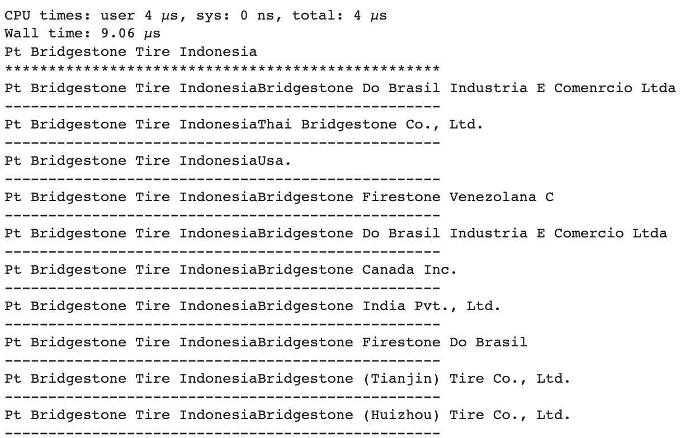
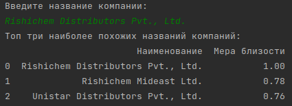

# ITMO_DL_in_practice_02
Курс "Глубокое обучение на практике" (Project_02)

# Company names matching

# Задачи проекта:

1. Задача классификации: определить, совпадают ли названия компаний.

2. Задача ранжирования: вывести N ближайших названий.

## Шаги проекта:

* **Эксперименты**

_Ноутбуки воспроизводимые, данные подгружаются с яндекс диска._

1) Подготовка данных:

   - нижний регистр
   - транслитерация
   - удаление "ООО", "ОАО", 'общество с ограниченной ответственностью',
     'открытое акционерное общество' etc
   - удаление ltd., LLC etc с использованием CLEANCO
   
   в ноутбуке preproc_naming_classification.ipynb [ноутбук](preproc_naming_classification.ipynb)
   
2) Далее были созданы новые фичи, например такие как:

   - Levenshtein
   - Discounted_Levenshtein
   - String Subsequence Kernel Similarity
   - Jaro Similarity
   - и др.
    
    в ноутбуке preproc_naming_classification.ipynb [ноутбук](preproc_naming_classification.ipynb)

3) Произведены эксперименты по отбору фичей:

    - использована permutation importance 
      на основе градиентного бустинга и логистической регрессии
      
    в ноутбуке experiments_naming_classification.ipynb [ноутбук](experiments_naming_classification.ipynb)

4) Обучена модель классификации:

Метрики: 
| Metric\Model | GradientBoosting | LogisticRegression|
|--|--|--|
| precision macro avg | 0.61 | 0.83 |
| precision weighted avg | 0.99 | 0.99 |
| recall macro avg | 0.68 | 0.61 |
| recall weighted avg | 0.99 | 0.99 |
| f1-score macro avg | 0.64 | 0.67 |
| f1-score weighted avg | 0.99 | 0.99 |
| AUC | 0.51 | 0.51 |

   в ноутбуке experiments_naming_classification.ipynb [ноутбук](experiments_naming_classification.ipynb)

5) Решение задачи ранжирования:

    Для этой задачи были использованы эмбеддинги, построенные на Word2Vec и FastText.
    Модели Word2Vec и FastText были обучены на всем корпусе компаний.
    
    Для решения проблемы долгого поиска соседей была использована библиотека ANNOY, что существенно оптимизировало поиск, без проблем возможно    масштабирование проекта.
   
    в ноутбуке w2v_fasttext.ipynb [ноутбук](w2v_fasttext.ipynb)
    
Скорость обработки CPU в **микросекундах**:
| Model | word2vec | FastText |
|--|--|--|
| Time | 9.06 µs | 26 µs |

Пример выдачи модели word2vec

---

* **Рабочий скрипт**

   [modules.py](./modeles.py) - содержит функцию предобработки строк
   
   [preprocessing.py](./preprocessing.py) - скрипт для нормализации исходных данных
   
   [response.py](./response.py) - скрипт принимающий на вход строку и выводящий топ N
   похожих
   
# Запуск проекта

1) Установить зависимости командой "pip install -r requirements.txt"
2) Нормализовать строки в датасете с помощью скрипта "preprocessing.py", затем запустить скрипт "response.py"

Результаты работы:

## Команда 9.

Вопросы telegram @dum_ai

